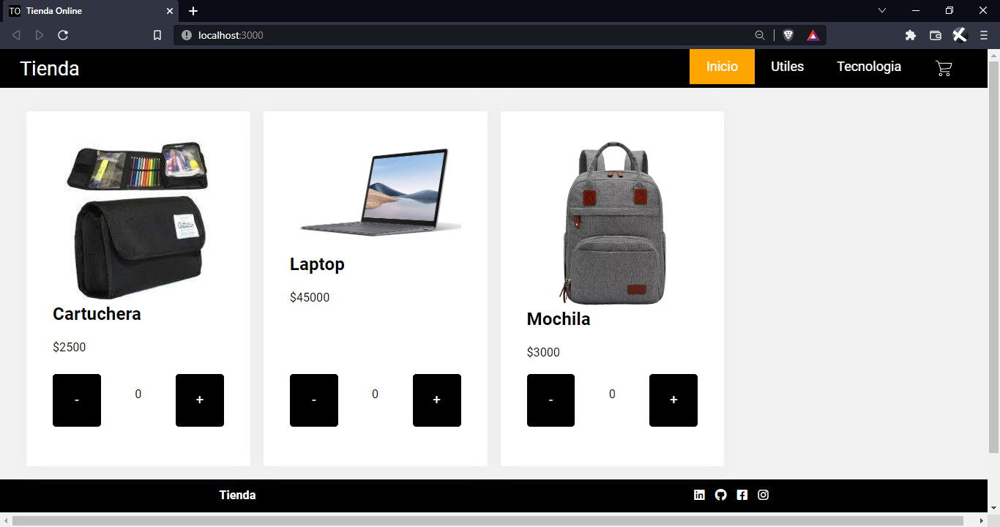

# E-commerce con ReactJS

Tienda generica y minimalista, de facil uso y mantenimiento hecho con ReactJS, SASS y Firebase

Facundo Toffolo Pasquini - [LinkedIn](https://www.linkedin.com/in/faqtoff/)

### Proyecto final ReactJS - CoderHouse

- Profesor: Horacio Gutierrez Estevez
- Tutor: Diego Grassino
- Comisión: 25465
- Comienza: 10 febrero 2022
- Termina: 31 marzo 2022
- Feriados contemplados en la cursada:
  - 01/03/2022 - Carnaval (INT)
- Días: Martes y Jueves
- Horarios: 10:00 a 12:00hs
- Zona horaria (\*) America/Buenos_Aires
- Frecuencia de valoraciones: Semanal

## Uso

### Simulacion de la App


### Demo

- [Firebase Hosting](https://tiendacom-ar.web.app/)
- [Vercel Hosting](https://tiendaecommerce.vercel.app/)

## Instalacion

1. Clonar el repositorio:
   ```
   git@github.com:faqtoff/CoderHouse_ReactJS.git
   cd CoderHouse_ReactJS
   ```
2. Instalar los paquetes y carpeta node_modules:
   ```
   npm install
   ```
3. Reviso las variables de entorno para la conexion con firebase.

   Para esto se debe configurar el archivo `.env` en la raiz del proyecto con el siguiente formato:

   - [Configuracion de firebase:](https://firebase.google.com/docs/web/learn-more#config-object)
     ```
     REACT_APP_FIREBASE_CONFIG.apiKey = XXXXXXXXXXXXXX
     REACT_APP_FIREBASE_CONFIG.authDomain = XXXXXX.firebaseapp.com
     REACT_APP_FIREBASE_CONFIG.projectId = XXXXXXXX
     REACT_APP_FIREBASE_CONFIG.storageBucket = XXXXXXX.appspot.com
     REACT_APP_FIREBASE_CONFIG.messagingSenderId = XXXXXXX
     REACT_APP_FIREBASE_CONFIG.appIdX= XXXXXXXX
     REACT_APP_FIREBASE_CONFIG.measurementId = XXXXXXXXXXX
     ```
   - Configuracion de las colecciones de datos (Seran las colecciones de Firebase Firestore desde donde la app leera la informacion):

     ```
     REACT_APP_DBPATH.stock=stock
     REACT_APP_DBPATH.orders=orders
     ```

   - Configuracion de los links de redes del footer:
     ```
     REACT_APP_SOCIAL.linkedin=https://www.linkedin.com/in/faqtoff
     REACT_APP_SOCIAL.github=https://www.linkedin.com/in/faqtoff
     REACT_APP_SOCIAL.facebook=https://www.linkedin.com/in/faqtoff
     REACT_APP_SOCIAL.instagram=https://www.linkedin.com/in/faqtoff
     ```
     En el footer apareceran los iconos solo de los links que existan en las variables de entorno
   - Si queremos obtener mas de un entorno (desarrollo y produccion), se deben agregar las variables correspondientes a cada uno, en el mismo formato mostrado, pero en los archivos `.env.development` y `.env.production`. Verificar archivo .gitignore

4. Levanto la app de modo local:

   ```
   npm run start
   ```

   - Si tengo dos entornos (desarrollo y produccion):
     - Desarrollo:
       ```
       npm run start
       ```
     - Produccion:
       ```
       npm run start:prod
       ```

## Deploy

### Build

- `npm run build` Para obtener una version development
- `npm run build:prod` Para obtener una version production

### Firebase

Para hacer el deploy a firebase, es necesario tener instalado [_Firebase CLI_](https://firebase.google.com/docs/cli?hl=es-419) en la computadora

#### Inicializar proyecto de Firebase

Para iniciar el proyecto de Firebase en esta app, hay que iniciar sesion en [_Firebase CLI_](https://firebase.google.com/docs/cli?hl=es-419):

```
firebase login
```

Inicializamos [_Firebase CLI_](https://firebase.google.com/docs/cli?hl=es-419):

```
firebase init
```

1. Seleccionar la opcion Hosting
2. `What do you want to use as your public directory? (public) ` - Reemplazar public por build
3. `? Set up automatic builds and deploys with GitHub?` Opcional
4. `? Configure as a single-page app (rewrite all urls to /index.html)? (y/N) ` - y

Una vez finalizado el proceso, notaras que se crearon los archivos `.firebaserc` y `firebase.json`.

- `.firebaserc`: Configuras los proyectos de firebase que vas a usar:
  ```
  {
    "projects": {
      "default": "proyecto-dev",
      "development": "proyecto-dev",
      "production": "proyecto-prod"
    }
  }
  ```
- `firebase.json`: Es la configuracion de los servicios de firebase que usaras. En este caso, del hosting:

  ```
  {
    "hosting": {
      "public": "build",
      "ignore": [
        "firebase.json",
        "**/.*",
        "**/node_modules/**"
      ],
      "rewrites": [
        {
          "source": "**",
          "destination": "/index.html"
        }
      ]
    }
  }
  ```

  Para ejecutar los Deploys manuales, el archivo `package.json` de este proyecto ya incluye unos comandos de utilidad:

  - `npm run deploy` Hace un deploy al proyecto default de firebase
  - `npm run deploy:dev` Hace un deploy al proyecto development de firebase
  - `npm run deploy:prod` Hace un deploy al proyecto production de firebase

## Tecnologias Usadas

- [fontawesome](https://fontawesome.com/)
- [react](https://reactjs.org/)
- [env-cmd](https://github.com/toddbluhm/env-cmd#readme)
- [react-toastify](https://github.com/fkhadra/react-toastify#readme)
- [react-router-dom](https://reactrouter.com/)
- [firebase](https://firebase.google.com/)
- [node-sass](https://github.com/sass/node-sass)

## Comandos GIT utiles

- `git checkout -b nuevobranch`: crea un nuevo branch con el nombre `nuevobranch`
- `git checkout branch`: se mueve al branch llamado `branch`
- `git pull`: Obtiene los datos actualizados del repositorio en la nube
- `git pull origin master`: Obtiene los datos actualizados de la rama master en la nube
- `git add .`: Agrega los cambios al commit
- `git commit -m 'Comentario de lo que se esta guardando'`: Guarda el commit con un texto
- `git push`: Envia los cambios locales al repositorio en la nube

## Imagenes de la App

- Inicio
  

- Articulo
  

- Carrito
  

## Agradecimientos

Agradezco a Horacio Gutierrez Estevez, profesor del curso ReactJS de CoderHouse, con quien clase a clase fui construyendo esta tienda.
Agradezco tambien a Diego Grassino, tutor de la comision 25465 de ReactJS, por la buena onda, las ayudas y correcciones.
